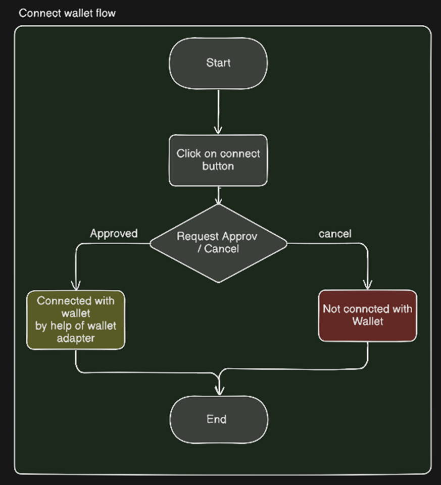
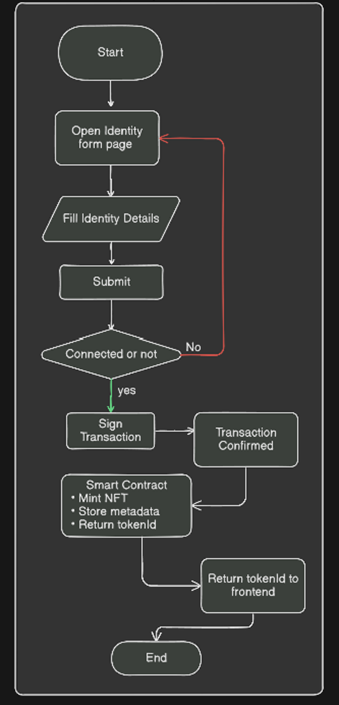
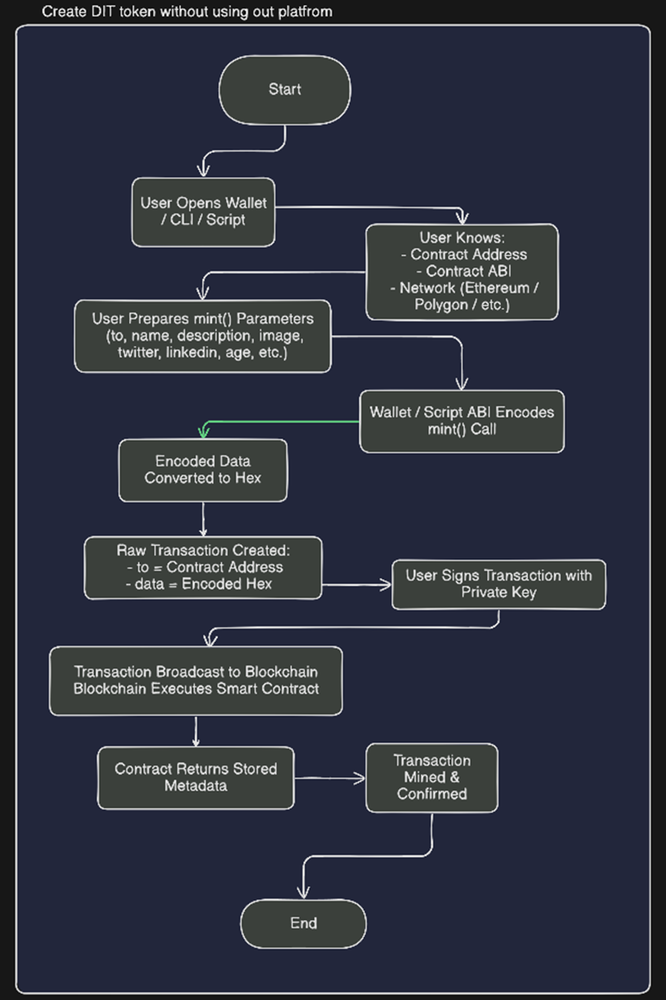
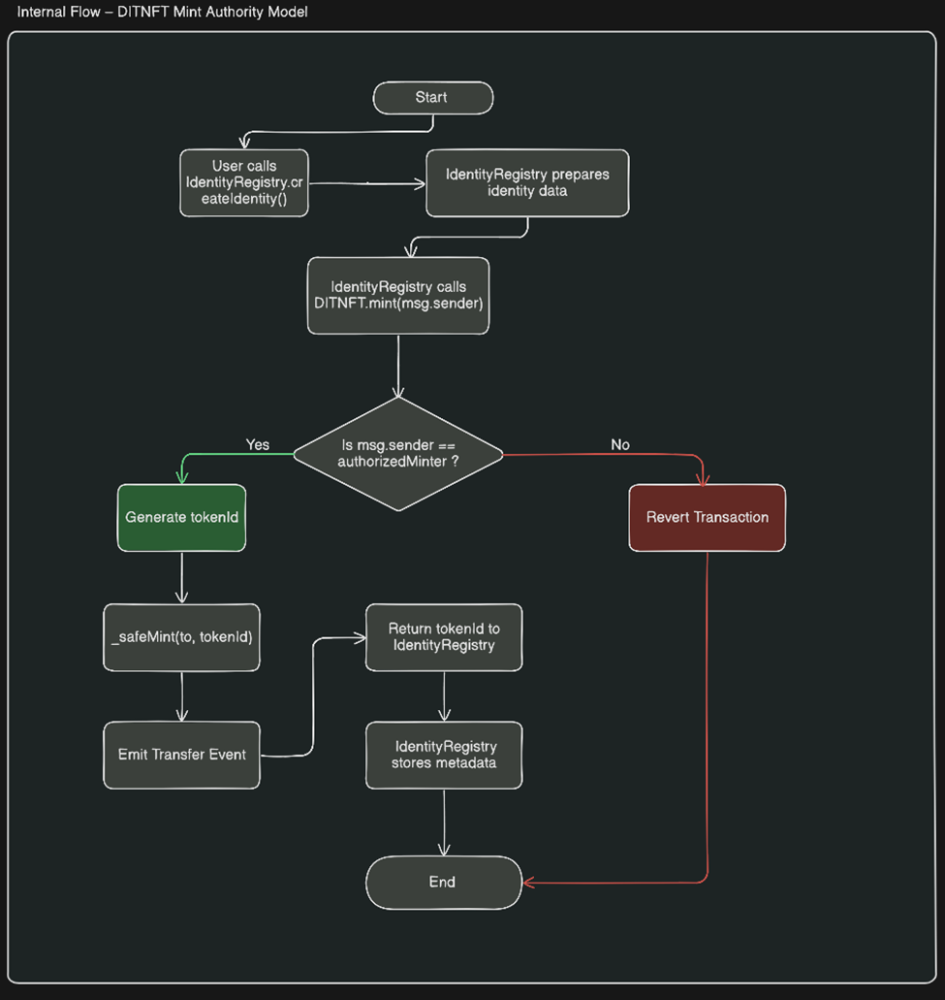
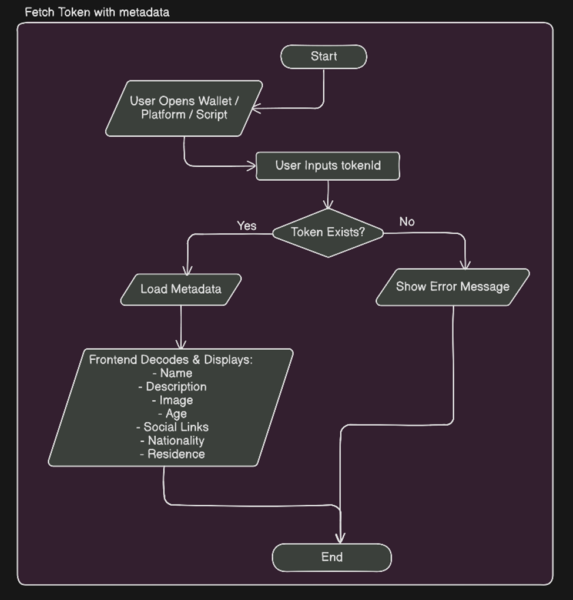
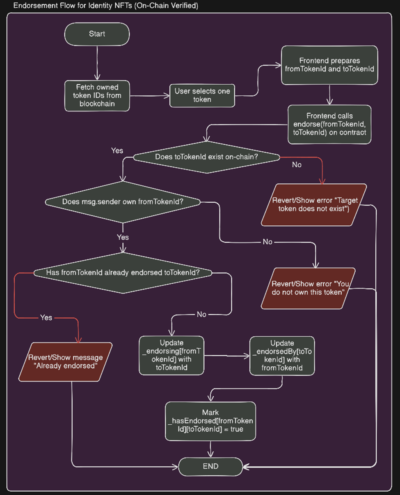
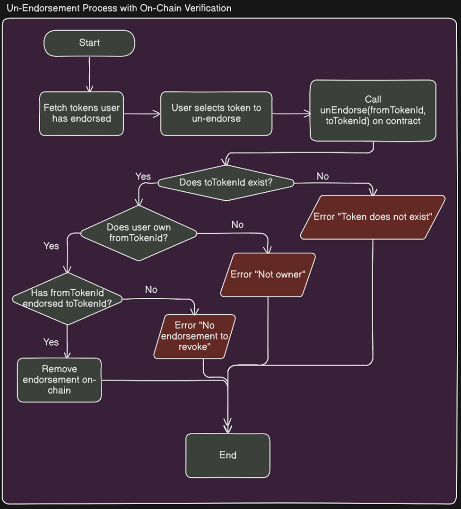
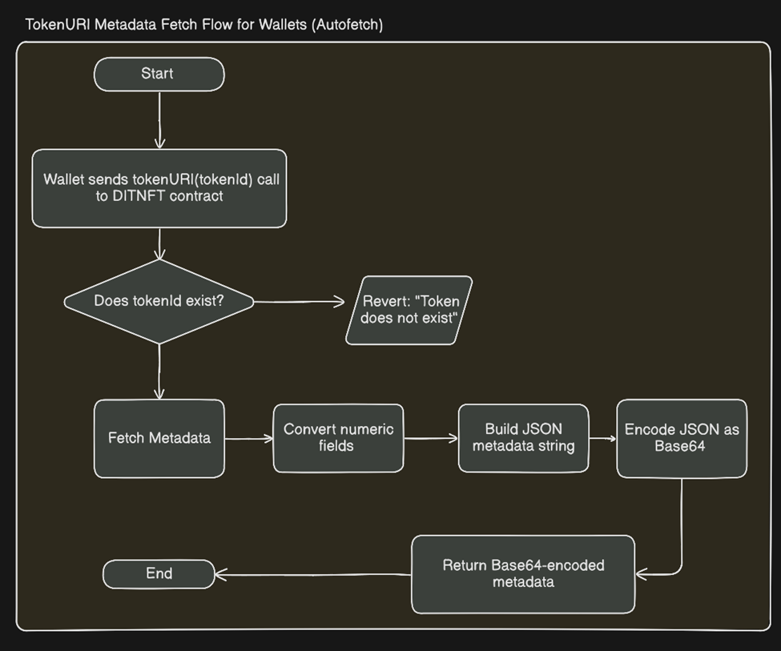

# 📘 WORKFLOWS

This document provides an overview of all major workflows in the system. Each section includes a brief explanation and a visual diagram to help you quickly understand how different parts of the platform interact.

---

## 🔗 Connect Wallet

This is the entry point for users. By connecting a wallet, users can securely interact with the platform, sign transactions, and access features like token creation and endorsements.

  

---

## 🪙 Create DIT Token (Using Platform)

Users can create a DIT token through a simple and guided UI. The platform handles contract interaction, metadata setup, and transaction flow, making it beginner-friendly.

  

---

## ⚙️ Create DIT Token (Without Platform)

This workflow is for advanced users who prefer direct interaction with smart contracts. It involves manually calling contract functions and handling parameters without the platform UI.

  

---

## 🔄 Internal Flow for Token Creation

This flow explains what happens behind the scenes when a token is created — including contract deployment/interactions, metadata linking, and backend processes (if any).

  

---

## 📦 Fetch Token Metadata

This workflow shows how token metadata is retrieved using the token URI. It includes fetching details like title, description, and other attributes stored off-chain or on-chain.

  

---

## 👍 Endorsement Flow

Users can endorse a token to validate or support it. This process includes wallet confirmation, on-chain verification, and updating the endorsement state.

  

---

## 🔄 Un-Endorsement Flow

This flow allows users to remove their endorsement. It ensures proper validation and updates the blockchain state accordingly while maintaining data integrity.

  

---

## 🔍 Auto-fetch Metadata via Token URI

Wallets and applications can automatically fetch token metadata using the token URI. This improves usability by displaying token details without manual input.

  

---

> 💡 These workflows provide a clear understanding of how users and the system interact, covering both user-facing actions and internal processes.
